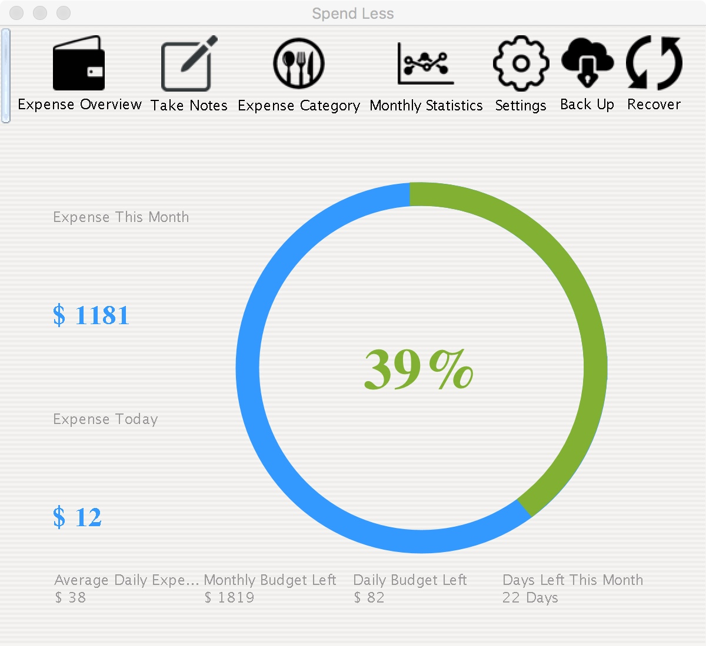
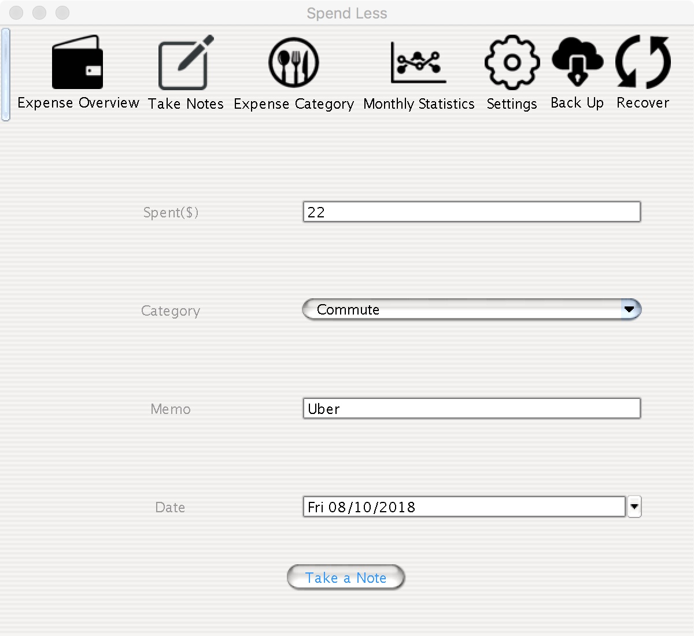
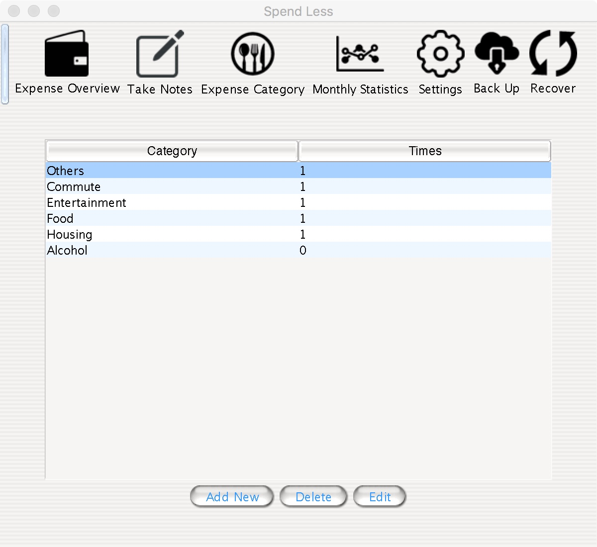
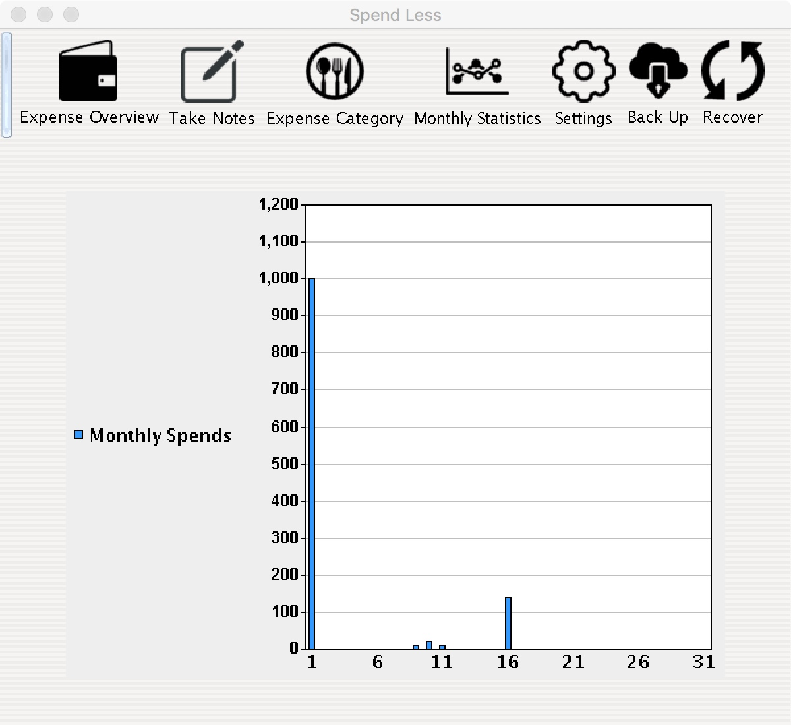

# SpendLess

SpendLess is a Java swing program used to track daily & monthly cost. Built with basic software engineering principles in mind (Entity, DAO, Services).

## Fork it and try it if you are interested!
You can run this program by running the .java file in package src/startup. Mysql has to be installed and configured correctly.
Several external libraries are used (you can find them on google):
JXDatePicker, jdbc connector for Mysql, easyChart for java, and linquidlnf for setting up java swing's skin.

## Supported functions
The software supports several main functions.
* *A Monthly Overview Page that gives user an idea of the money he/she has spent, the budget he/she has, daily expense has to be controlled in order to make users not waste money*
* *A Take Note Page that allows users to record everything they spent on based on their categories and date*
* *A Category Page that allows users to add, delete or edit current categories list*
* *A Report Page that presents the statics of the amount of money spent on each day of the current month*
* *A Configuration Page where users can set monthly budget*
* *A Backup and Recover Pages that allow users to backup the data of previous months and retrieve them simply when they want to look at their old monthly expense records*

## Software Interfaces

Some of the main supported pages are shown below:

### Monthly Overview Page

### Take Notes Page

### Category Page

### Report Page

